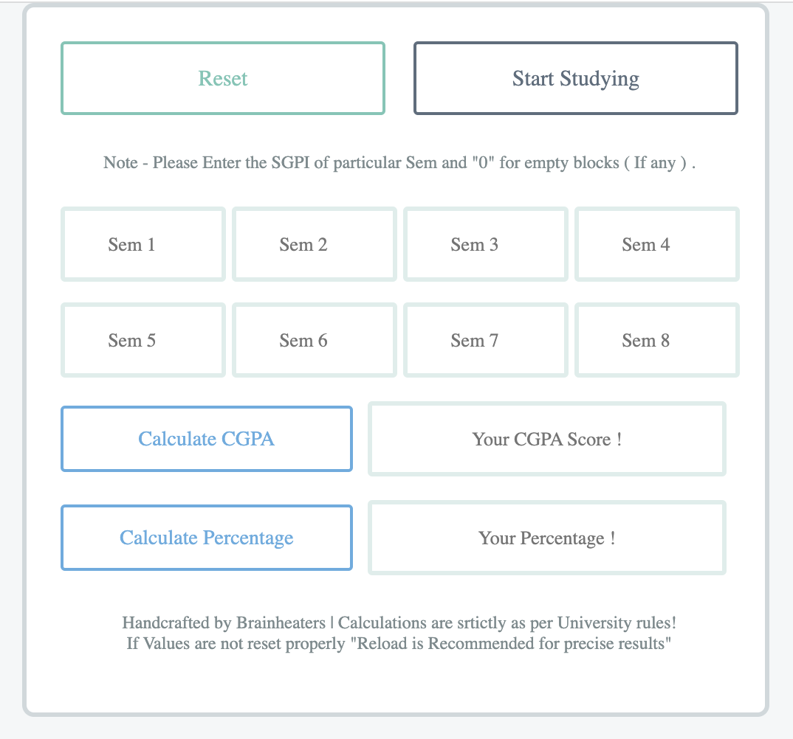
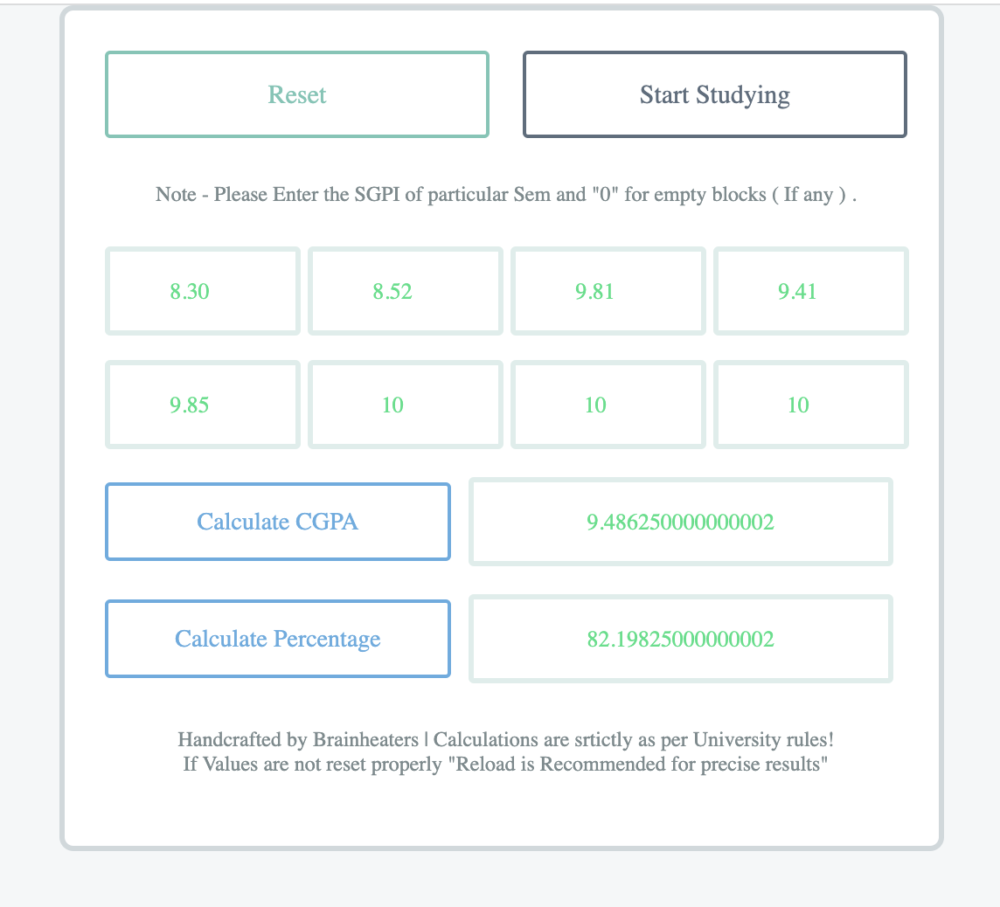

# GPA Averaging and Percentage Calculation
This repository contains a web application built using HTML, CSS, and JavaScript that allows users to calculate their cumulative GPA (Grade Point Average) and percentages based on their GPA for each semester. The application was developed specifically for brainheaters.in.

## Functionality
The GPA Averaging and Percentage Calculation web application provides the following features:

GPA Averaging: Users can input their GPA for each semester, and the application will calculate the cumulative GPA by averaging all the individual semester GPAs.

Cumulative Percentage: Based on the GPA entered for each semester, the application calculates the cumulative percentage.

## Usage
To use the GPA Averaging and Percentage Calculation web application, simply access the application through forking the repo and clicking on the HTML file. Users will be presented with an interface where they can enter their semester GPAs. The application will then calculate the cumulative GPA and percentage.

Please refer to the code provided in this repository for more information on the implementation details of the web application.

## User-interface

